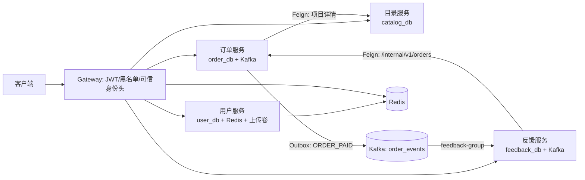
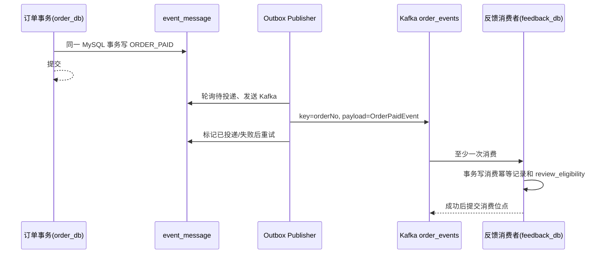
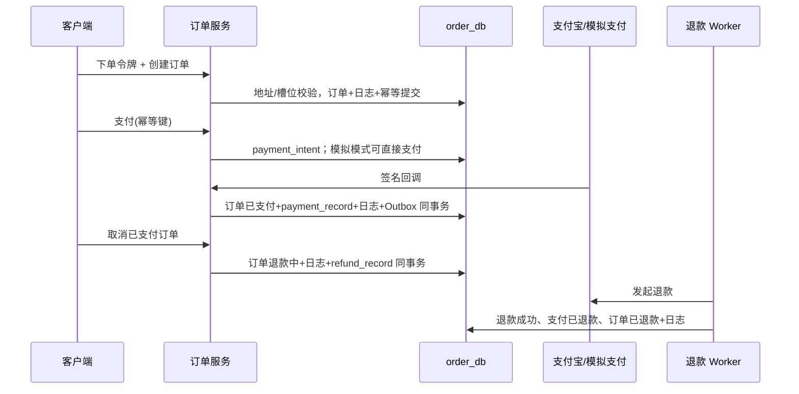

# 接口与数据流实现说明

## 1. 范围、依据与阅读约定

本文描述当前工作树已实现的行为，不补充真实短信、真实支付、管理端或跨库分布式事务等尚未实现能力。事实来源为各服务的 Controller、Service、Mapper XML、初始化 DDL 和 `application*.yml`；接口路径均以网关入口为准，内部接口除外。

- 服务：网关 `8080`，用户 `8081`，目录 `8082`，订单 `8083`，反馈 `8084`；服务通过 Nacos（`NURSING` group）发现与读取按 `${service}-${profile}.yaml` 命名的配置。
- 持久化：服务分别拥有 `user_db`、`catalog_db`、`order_db`、`feedback_db`，没有业务外键或跨库事务。所有业务库均使用各服务 `deploy/mysql/init` 中的初始化脚本。
- 公共模块：`nursing-common` 提供统一 `Result`、错误码、雪花 ID 和领域 DTO。订单服务通过本地 `CatalogServiceFeignClient` 查询目录；反馈服务通过本地 `OrderFeignClient` 查询订单内部接口。
- 本文的"事务"指 Spring/MySQL 事务。未标注 `@Transactional` 的查询没有业务事务；Mapper 的单条 SQL 仍由数据库自身语句原子性保证。
- 请求经网关时，网关先删除客户端伪造的 `X-User-Id`、`X-UserId`、`userId`、`X-Gateway-Token`，验签 JWT 和 Redis 黑名单后才写入可信的 `X-User-Id`、`X-Gateway-Token`。目录公开查询和支付回调为配置的公开路径；其余 `/api/v1/**` 默认需要 JWT。业务服务中用户服务使用请求属性 `userId`，订单/反馈还再次校验可信网关令牌。

### 1.1 存储归属与事务边界

| 边界 | 所有者和内容 | 一致性方式 |
|---|---|---|
| `user_db` | 用户、JWT 审计、短信请求/审计/Outbox、上传幂等和文件元数据 | 用户业务使用本地事务；短信以 MySQL Outbox 和 Worker 衔接 Redis/短信提供方 |
| `catalog_db` | 分类、项目、规格及种子数据 | 只读查询；订单在下单时复制目录快照 |
| `order_db` | 地址、订单、支付、支付意图、退款、操作日志、下单幂等、事件 Outbox | 本地事务提交订单状态、支付记录和 Outbox；Kafka 由定时投递，退款由 Worker 最终完成 |
| `feedback_db` | 评价、图片、投诉、投诉轨迹、评价资格、消费者幂等 | 评价/投诉/消费者各自本地事务；订单数据由 Feign 读取 |
| Redis | 网关 JWT 黑名单；用户 JWT 会话提示、验证码摘要、短信限流配额 | Redis 不参与 MySQL 事务；网关访问 Redis 异常时按黑名单命中拒绝请求 |
| 文件卷 | 用户服务将上传内容放在 `upload-dir` 下，Nginx 映射 `/uploads/` | 文件先落临时文件，再在 MySQL 事务内原子移动并写元数据；磁盘移动不能随数据库回滚 |

## 2. 网关与公共模块

### 2.1 路由和鉴权

| 路由前缀 | 目标服务 | 访问属性 |
|---|---|---|
| `/api/v1/users/**`、`/api/v1/files/**` | 用户 | 注册、登录、发送短信、重置密码公开；短信请求状态、资料、退出和上传要求 JWT |
| `/api/v1/categories/**`、`/api/v1/items/**` | 目录 | 公开只读 |
| `/api/v1/orders/**`、`/api/v1/addresses/**` | 订单 | 除 `/api/v1/orders/pay/callback` 外要求 JWT |
| `/api/v1/reviews/**`、`/api/v1/complaints/**` | 反馈 | 要求 JWT |

网关的 `JwtAuthGlobalFilter` 使用同一 JWT 密钥验签、取 `jti` 和 `userId`，查询 `jwt:blacklist:{jti}`。注销路径允许已拉黑 JWT 再通过，以便用户服务可重试写黑名单；其他已拉黑令牌返回未授权。网关不路由 `/internal/**`，该路径只应由服务网络访问，并由 `X-Internal-Token` 二次鉴权。

### 2.2 Redis 键

| 键 | 写入方/TTL | 用途 |
|---|---|---|
| `jwt:blacklist:{jti}` | `TokenService.logout`，到 JWT 原过期时间 | 注销后的网关拒绝名单 |
| `user:token:{userId}:{jti}` | 登录/注册，JWT 有效期 | 用户令牌到期提示；当前网关认证不读取该键 |
| `sms:code:{type}:{phone}` | 短信 Worker 成功调用供应商后，验证码有效期 | 仅保存验证码摘要；校验成功会删除该键 |
| `sms:verify:fail:{type}:{phone}` | 验证码错误时，与验证码键同 TTL | 错误计数，超阈值删除验证码键并阻止重试 |
| `sms:rate:{type}:{phone}` | 受理时，短信冷却期 | 同手机号、类型的短时限流（Lua 原子创建） |
| `sms:quota:phone:day:{phone}:{yyyyMMdd}` | 到次日零点 | 手机号日额度 |
| `sms:quota:ip:hour:{ip}:{yyyyMMddHH}` | 到下个整点 | IP 小时额度 |
| `sms:quota:ip:day:{ip}:{yyyyMMdd}` | 到次日零点 | IP 日额度 |

## 3. 用户服务

### 3.1 `POST /api/v1/users/register`

- 公开接口。
- 校验 `phone`、`password`、`smsCode`、`nickname`；短信类型固定为 `register`。
- 查询 `user` 表 `phone`：已存在则 `PHONE_ALREADY_REGISTERED (422)`。
- 校验验证码：`SmsService.verifySmsCode(phone, "register", smsCode)`。
  - 通过 Redis Lua 原子脚本 `verifyAndConsume` 执行：读取 `sms:code:register:{phone}`，不存在返回 `EXPIRED`；读取 `sms:verify:fail:register:{phone}` 错误计数超阈值返回 `TOO_MANY` 并删除验证码键；摘要不匹配递增错误计数返回 `INVALID`；匹配成功删除两个键返回 `OK`。
  - 若返回 `OK`，在 `TransactionTemplate` 内执行 `smsRecordMapper.markLatestVerified` 将最近一条 `sms_record` 标记为已验证。
  - 若返回 `EXPIRED`/`INVALID`/`TOO_MANY`，抛出对应 `400/422` 错误并回滚不提交。
- 开始 `@Transactional`：
  - 生成雪花 ID。
  - BCrypt 编码密码。
  - 构造 `User`：`status=0`、`isDeleted=0`、`version=0`。
  - `userMapper.insert(user)`；手机号唯一键冲突抛出 `PHONE_ALREADY_REGISTERED` 并回滚。
  - 生成 JWT：`TokenService.generateToken(user)` 产生 `jti`、签发 `userId`/`phone` 声明。
  - 插入 `user_token` 审计记录，写入 Redis `user:token:{userId}:{jti}`（TTL = JWT 有效时长）。
- 返回 `201`、令牌和过期时间。

### 3.2 `POST /api/v1/users/login`

- 公开接口。
- 校验 `phone`、`loginMode`（`password`/`sms`）、对应凭据。
- 查询 `user` 表 `phone`：不存在则 `PHONE_NOT_REGISTERED (422)`。
- 检查 `status`：禁用用户抛出 `USER_DISABLED (423)`。
- 密码登录分支：
  - 调 `UserService.validatePasswordLogin`：`passwordEncoder.matches` 比对 BCrypt，不匹配抛出 `PASSWORD_INCORRECT (422)`。
- 短信登录分支：
  - 调 `UserService.validateSmsLogin`：`smsService.verifySmsCode(phone, "login", smsCode)`（同一 Lua 原子校验过程）。
- 开始 `@Transactional`：
  - `userMapper.updateLastLoginTime(userId, now)`。
  - 生成 JWT：`TokenService.generateToken(user)`。
  - 插入 `user_token`，写入 Redis `user:token:{userId}:{jti}`。
- 返回令牌和过期时间。

### 3.3 `POST /api/v1/users/logout`

- JWT 鉴权（注销路径允许已拉黑令牌通过）。
- 用户拦截器（`UserTokenInterceptor`）从 `Authorization` 头解析 Bearer 令牌。
- 调用 `TokenService.invalidateToken(token)`：
  - 解析 JWT 获取 `tokenId`。
  - 计算剩余 TTL = `expiration - now`。
  - `redisTemplate.opsForValue().set("jwt:blacklist:{tokenId}", "1", ttlSeconds)`。
- 无 `@Transactional` 业务事务、无 MySQL 写入。
- 返回操作成功。

### 3.4 `POST /api/v1/users/password/reset`

- 公开接口。
- 校验 `phone`、`smsCode`、`newPassword`。
- 查询 `user` 表 `phone`：不存在则 `PHONE_NOT_REGISTERED (422)`。
- 校验验证码：`smsService.verifySmsCode(phone, "reset_password", smsCode)`（同一 Lua 原子校验过程）。
- `passwordEncoder.matches(newPassword, existingPassword)`：相同则抛出 `PASSWORD_SAME_AS_OLD (400)`。
- 开始 `@Transactional`：
  - BCrypt 编码新密码。
  - `userMapper.updatePassword(phone, encodedNewPassword, now)`。
- 返回操作成功；失败分支回滚更新。

### 3.5 `GET /api/v1/users/profile`

- JWT 鉴权后 `UserTokenInterceptor` 将 `userId` 注入请求属性。
- 无 `@Transactional` 业务事务。
- 查询 `user` 表 `id`；不存在抛出 `USER_NOT_FOUND`。
- 检查 `status`，禁用用户抛出 `USER_DISABLED`。
- 通过 `IdCardCrypto` 解密身份证号、脱敏手机号后返回 `UserInfoResponse`。

### 3.6 `PATCH /api/v1/users/profile`

- JWT 鉴权。
- 校验 DTO：身份证格式（18 位），客户端须传入当前 `version`。
- 开始 `@Transactional`：
  - 查询当前 `user` 记录。
  - 身份证加密：`idCardCrypto.encrypt(idCard)`。
  - `userMapper.updateProfile(id, nickname, avatar, gender, encryptedIdCard, version)`——按 `id + version` 乐观更新。
  - 更新行数 0 时抛出 `VERSION_CONFLICT` 回滚。
  - 回读更新后记录，返回 `ProfileUpdateResponse`（含新版本号）。
- 相同内容重复请求可允许（与上次一致的写入结果相同）。

### 3.7 `POST /api/v1/users/sms-code`

- 公开接口。
- **参数校验：**
  - 校验 `phone` 和 `smsType`，短信类型包括 `register`、`login`、`reset_password`。
- **手机号状态校验：**
  - `register` 类型：查询 `user` 表 `phone`，已存在则抛出 `PHONE_ALREADY_REGISTERED (422)`。
  - `login` / `reset_password` 类型：查询 `user` 表 `phone`，不存在则抛出 `PHONE_NOT_REGISTERED (422)`。
- **解析客户端 IP：**
  - `ClientIpResolver`：优先读 `X-Forwarded-For` 首段，其次 `X-Real-IP`，最后 `request.getRemoteAddr()`。
  - 过滤掉 `unknown` 和超长值。
- **校验 `Idempotency-Key`：**
  - 必须为 UUID 格式 `{8}-{4}-{4}-{4}-{12}`。
  - 查询 `sms_send_request` 表 `idempotency_key` 唯一键。
  - 若已存在终态记录且未过期（`status=2,3,4` 且 `idempotent_expire_time < now`），先删除；其余情况直接重放。
  - 若存在记录：比对请求指纹 `SHA-256(phone|smsType)`，不一致返回冲突；一致返回原受理响应（包含 `requestId`、`status`、`createTime` 等）。
- **Redis Lua 原子限量占位（`SmsRateLimiter.checkAndReserve`）：**
  - 对 `sms:rate:{type}:{phone}`（冷却）、`sms:quota:phone:day:{phone}:{yyyyMMdd}`（手机日限）、`sms:quota:ip:hour:{ip}:{yyyyMMddHH}`（IP 小时限）、`sms:quota:ip:day:{ip}:{yyyyMMdd}`（IP 日限）四个键 Lua 原子执行：
    - 冷却键存在 → 返回 `RATE_LIMITED`。
    - 额度键超限 → 返回 `PHONE_DAILY_LIMITED` / `IP_HOURLY_LIMITED` / `IP_DAILY_LIMITED`。
    - 否则设置所有键（额度键 TTL 到下一个整点/次日零点，冷却键 TTL 为配置的 `rateLimitSeconds`），关联随机 `token`，返回 `OK`。`
  - 任一项不通过抛出 `SmsRateLimitException(429, retryAfterSeconds)` 或 `TOO_MANY_REQUESTS`。
- **同一数据库事务创建请求和 Outbox（`TransactionTemplate`）：**
  - 生成雪花 ID，插入 `sms_send_request`（status=`0` PENDING，携带 `idempotencyKey`、`requestFingerprint`、`phone`、`smsType`、`requestIp`、`responseSnapshot`、`idempotentExpireTime` 等）。
  - 若插入失败（幂等键冲突）：读取已有记录，指纹一致重放，不一致返回冲突。
  - 插入 `sms_outbox_event`（`eventType="SMS_SEND"`，`status=0` PENDING，`nextExecuteTime=now`）。
- **事务提交后：**返回 `SmsCodeResponse(requestId, status="PENDING", message="验证码发送任务已受理")`，不等待短信实际发出。
- **事务异常分支：** 如果 Redis 预占成功但 MySQL 事务回滚（如并发幂等冲突）：catch 块中调 `smsRateLimiter.cancelReservation` 回滚 Redis 限量预占。

### 3.8 `GET /api/v1/users/sms-code/requests/{requestId}`

- JWT 鉴权。
- 必须携带与初次请求相同的 `Idempotency-Key` 头。
- 无 `@Transactional` 业务事务。
- 查询 `sms_send_request` 表 `id` 和 `idempotency_key`；不匹配返回 `404`。
- 返回 `SmsCodeResponse`：`requestId`、`status`（`0` PENDING / `1` PROCESSING / `2` SENT_ACCEPTED / `3` FAILED / `4` UNKNOWN）、初态快照 `responseSnapshot`、失败描述等。

### 3.9 `POST /api/v1/files/upload`

- JWT 鉴权。
- **参数校验：**
  - 校验 `Idempotent-Key`（头名 `Idempotent-Key`）：非空、长度 ≤ 128。
  - 校验 `bizType` 值：允许 `avatar`、`review_image`、`complaint_image`。
  - 校验文件：非空、≤ 10 MiB、扩展名（png/jpg/jpeg/gif/webp）、Content-Type 必须为对应的 MIME 类型。
- **幂等检查：**
  - 按 `scopedKey = "fu:{userId}:{idempotentKey}"` 查询 `idempotent_record`。
  - 若已完成（`status=1`）：通过 `idempotentRecordMapper.complete` 的返回判断是否为文件幂等，一致返回已有 `FileUploadResponse`；不一致抛出 `FILE_IDEMPOTENCY_CONFLICT (409)`。
  - 若处理中（`status=0`）：抛出 `FILE_UPLOAD_PROCESSING (409)`。
- **前置步骤（事务外）：**
  - 通过 `DigestInputStream` 流式写入临时文件，同时计算 `SHA-256`。
  - 按内容哈希和业务类型去重：查询 `file_upload_record` 表 `(user_id, biz_type, file_hash, file_ext)`，若已有记录且文件存在则直接返回。
- **开始 `@Transactional`：**
  - 插入 `idempotent_record`（status=`0` PROCESSING，唯一键 `idempotent_key`）。
  - 若内容去重未命中：将临时文件 `move` 到最终路径 `upload-dir/{bizType}/{userId}/{hash前2位}/{hash}.{ext}`。
  - 插入 `file_upload_record` 元数据（含 SHA-256、路径、文件名、扩展名、内容类型等）。
  - 调 `completeIdempotent` 将幂等记录标记为完成并关联 `file_upload_record.id`。
- **一致性说明：** 磁盘 `move` 不可随数据库回滚；但 move 发生在临->目的路径，且由幂等记录和 SHA-256 确保重复请求只创建一份文件。

### 3.10 短信后台入口

#### `SmsOutboxWorker.dispatchPending()`

- 通过 `@Scheduled` 定时执行（默认每 1000ms）。
- **恢复过期租约：** `smsOutboxEventMapper.selectStaleProcessing` 查询超过处理超时（默认 120s）的处理中事件，调用 `markUnknown`，标记事件为 `UNKNOWN (3)`、请求为 `UNKNOWN (4)`——不会自动重发，避免重复短信。
- **批量领取待处理事件：** 查询 status=`0` 且 `nextExecuteTime ≤ now` 的事件，最多 `outboxBatchSize`（默认 50）条。
- **竞争领取：** `smsOutboxEventMapper.claim(eventId, workerId, leaseExpireTime, now)`，行数为 0 则跳过。
- **生成并持久化验证码：**
  - `SmsCodeGenerator.generate()` 生成 6 位数字验证码明文。
  - `TransactionTemplate` 内：
    - 生成雪花 ID，插入 `sms_record`：status=`0` PENDING、`sms_type`、`phone`、BCrypt 摘要（`smsCodeDigest.digest(plainCode)`）、`provider="mock"`、过期时间（默认 300s）。
    - 插入 `sms_record_status_transition`（`null → 0`，原因 `"SMS_WORKER_PRE_SEND"`）。
    - 标记请求 `sms_send_request` 为 status=`1` PROCESSING。
- **调用短信提供方：**
  - 当前配置 `provider="mock"`，`MockSmsSender.send()` 总是成功。
- **成功分支：**
  - 将验证码明文通过 `smsCodeDigest.digest(plainCode)` 写入 Redis：`SET sms:code:{type}:{phone} digest EX expire_seconds`。
  - `TransactionTemplate` 内：
    - 更新 `sms_record` 为 status=`1` SENT 并写入 `provider_request_id`、`provider_receipt`。
    - 插入 `sms_record_status_transition`（`0→1`，原因 `"SMS_SENT"`）。
    - 更新 `sms_send_request` 为 status=`2` SENT_ACCEPTED。
    - 更新 `sms_outbox_event` 为 status=`2` COMPLETED。
- **明确失败分支（提供方拒绝）：**
  - `TransactionTemplate` 内：
    - 更新 `sms_record` 为 status=`2` FAILED 并写入失败原因。
    - 插入 `sms_record_status_transition`（原因 `"SMS_SEND_FAILED"`）。
    - 更新 `sms_send_request` 为 status=`3` FAILED。
    - 更新 `sms_outbox_event` 为 status=`2` COMPLETED。
  - `smsRateLimiter.releaseRate(phone, smsType)` 释放冷却键，允许用户立即重试。
- **异常分支（网络超时、未知结果）：**
  - `smsOutboxWorker.markUnknown(event, requestId, smsRecordId, errorMessage, workerId)`：
    - 更新 `sms_outbox_event` 为 status=`3` UNKNOWN。
    - 若 `smsRecordId` 已分配：`smsRecordMapper.markUnknown(smsRecordId, ...)` 标记为 status=`5` UNKNOWN。
    - 若 `smsRecordId` 未分配：`smsSendRequestMapper.markUnknown(requestId, ...)` 标记为 status=`4` UNKNOWN。
  - 不自动重发、不释放冷却键，需外部干预。
- **预发送准备失败分支（如生成验证码抛错）：**
  - 按指数退避最多 `outboxMaxRetries` 次重试；重试间隔 = `min(outboxRetryBaseSeconds * 2^(retryCount-1), outboxRetryMaxSeconds)`。
  - 达到上限进入死信（status=`4` DEAD_LETTER）并标记 `sms_send_request` 为 FAILED。
  - 死信后释放限流键。

#### `SmsIdempotencyCleanup.deleteExpiredTerminalRequests()`

- `@Scheduled`，默认每 3600000ms（1 小时）。
- 批量删除 `idempotent_expire_time < now` 且 status 为终态（`2` SENT_ACCEPTED / `3` FAILED / `4` UNKNOWN）的 `sms_send_request` 记录，最多 `idempotentCleanupBatchSize` 条。

## 4. 目录服务

目录服务无 Redis、Kafka、Feign、文件存储和后台任务，所有 HTTP 查询均无 `@Transactional` 业务事务，只读取 `catalog_db`。

### 4.1 `GET /api/v1/categories`

- 公开接口。
- 无 `@Transactional` 业务事务。
- `CategoryService.buildCategoryTree()`：
  - 查询 `service_category` 表中所有可见（`status` 可见、`is_deleted=0`）且已上架的分类。
  - 在内存中按 `parent_id` 和 `path` 组装树形结构。
  - 孤儿节点（parent 不可见）保留为根节点。
- 返回分类树列表。

### 4.2 `GET /api/v1/items`

- 公开接口。
- **参数校验：**
  - `size`：规范到 `[1, 50]`，超出范围返回 `PARAM_ERROR`。
  - `keyword`：有值走搜索 SQL，无值走游标分页 SQL。
  - `cursor`：Base64 URL 解码为 `sortOrder:itemId`，非空但格式无效抛出 `PARAM_ERROR`。
  - `categoryId` 有值时：
    - 查询 `service_category` 表 `id` 的可视分类，不存在返回 `NOT_FOUND`。
    - 按 `path` 查询可见子孙分类 ID，若为叶子节点则仅限自身。
- 无 `@Transactional` 业务事务。
- `ItemService`：
  - 游标模式：`serviceItemMapper.selectVisibleByCategory` 按 `(sortOrder, id)` 向后翻页。
  - 搜索模式：`serviceItemMapper.searchVisible` 按关键字模糊匹配。
  - 取 `size+1` 条判断是否有下一页，截去最后一条。
  - `attachSpecs(items)`：批量查询 `service_spec` 附加至项目。
  - 下一页游标 = Base64 URL 编码 `{lastItem.sortOrder}:{lastItem.itemId}`（无填充）。
- 返回 `CursorPageResponse(items, size, hasNext, nextCursor)`。

### 4.3 `GET /api/v1/items/{id}`

- 公开接口。
- 校验 `id > 0`，否则返回 `PARAM_ERROR`。
- 无 `@Transactional` 业务事务。
- 查询可见项目（`service_item`）及关联规格（`service_spec`）。
- 项目不存在返回 `NOT_FOUND`。
- 若 `images` 数组为空，补充默认封面。
- 该接口也是订单 Feign（`CatalogServiceFeignClient.getItemDetail`）的依赖。

## 5. 订单服务

订单公开接口均要求网关注入的 `X-User-Id` 与匹配的 `X-Gateway-Token`；支付回调不走该校验。除特别说明外，异常会使当前 MySQL 事务回滚。

### 5.1 `GET /api/v1/addresses`

- JWT 鉴权。
- 无 `@Transactional` 业务事务。
- 查询 `user_address` 表 `user_id` 下 `is_deleted=0` 的所有地址。
- 返回地址列表。

### 5.2 `POST /api/v1/addresses`

- JWT 鉴权。
- 校验 DTO：收件人姓名、电话、区域、详细地址非空。
- 开始 `@Transactional`（`AddressServiceImpl.createAddress`）：
  - 若 `isDefault=1`：`userAddressMapper.clearDefault(userId)` 将该用户其他地址默认标记清空。
  - 生成雪花 ID，构造 `UserAddress`，`userAddressMapper.insert`。
- 返回新建地址 ID。

### 5.3 `PATCH /api/v1/addresses/{id}`

- JWT 鉴权。
- `ensureAddress(userId, addressId)`：查询 `user_address` 归属，不存在抛出 `ADDRESS_NOT_FOUND`。
- 开始 `@Transactional`：
  - 若请求中 `isDefault=1`：清空用户其他默认地址。
  - `userAddressMapper.updateByIdAndUserId(address)` 按 ID+用户更新。
- 返回更新后地址。

### 5.4 `DELETE /api/v1/addresses/{id}`

- JWT 鉴权。
- `ensureAddress(userId, addressId)` 校验归属。
- 开始 `@Transactional`：
  - `userAddressMapper.logicalDelete(addressId, userId)` 逻辑删除（`is_deleted=1`）。
- 返回操作成功。

### 5.5 `PUT /api/v1/addresses/{id}/default`

- JWT 鉴权。
- `ensureAddress(userId, addressId)` 校验归属。
- 开始 `@Transactional`：
  - `userAddressMapper.clearDefault(userId)` 清空用户其他默认标记。
  - `userAddressMapper.setDefault(addressId, userId)` 设置目标为默认。
- 返回操作成功。

### 5.6 `POST /api/v1/orders/prepay-token`

- JWT 鉴权。
- 无 `@Transactional` 注解（由业务方法内自行插入）。
- `IdempotentService.issuePrepayToken(userId)`：
  - 循环最多 3 次生成 `"pt_" + UUID(去连字符)` 令牌。
  - 插入 `idempotent_record`（`bizType="CREATE_ORDER"`，`status=0`，`expireTime=now+10min`）。
  - 插入成功即返回；`DuplicateKeyException` 重试下一次。
- 返回 `PrepayTokenResponse(token, expireTime)`。

### 5.7 `POST /api/v1/orders`

- JWT 鉴权，要求 `Idempotent-Key` = 上一步发放的 `pt_` 令牌。
- **服务项可售性校验（事务外）：**
  - Feign `GET /api/v1/items/{serviceItemId}` 读取项目详情。
  - 校验项目可见且在架；校验所选规格 `serviceSpecId` 在项目内、可见且在售。
  - 不满足抛出 `ITEM_UNAVAILABLE` 或 `SPEC_UNAVAILABLE`。
- **令牌校验（事务外）：**
  - `idempotentService.selectByKeyForUpdate(idempotentKey)` 锁读令牌记录。
  - 令牌不存在、`bizType` 不是 `CREATE_ORDER`、用户不匹配 → `IDEMPOTENT_INVALID`。
  - 令牌已完成（`status=1`）：比对请求指纹 `SHA-256(serviceItemId|serviceSpecId|addressId|serviceDate|serviceTimeSlot|remark|totalAmount)`，不一致返回 `IDEMPOTENT_INVALID`；一致通过 `orderHeaderMapper.selectById(bizId)` 重放返回已有订单。
- **开始 MySQL 事务（`TransactionTemplate`）：**
  - `lockUsableToken(userId, idempotentKey, requestFingerprint)`：先 `bindRequest` 将令牌与请求指纹绑定（row count 0 表示已过期/已绑定不同请求，抛错）；返回 `IdempotentRecord`。
  - 若令牌已完成且 `bizId` 有值：回查订单重放。
  - 校验服务日期：不可为过去。
  - 校验地址：`userAddressMapper.selectByIdAndUserId(addressId, userId)`，不存在抛出 `ADDRESS_INVALID`。
  - 同用户时段冲突：`orderHeaderMapper.countUserServiceSlot(userId, serviceItemId, serviceDate, serviceTimeSlot)` > 0 抛出 `SLOT_OCCUPIED`。
  - `orderSequenceMapper.nextSequence()` + `lastInsertId` 生成订单号。
  - 从 Feign 返回的项目名、规格名、规格价格构造 `OrderHeader`（status=`0` 待支付），并复制地址快照。
  - `orderHeaderMapper.insert(order)`：插入失败若为 `uk_user_service_slot` 唯一键冲突抛出 `SLOT_OCCUPIED`。
  - 插入 `order_operation_log`（action=`create`）。
  - `idempotentService.complete(idempotentKey, userId, fingerprint, orderId)` 将令牌标为完成。
- 返回 `OrderCreateResponse(orderId, orderNo)`。

### 5.8 `GET /api/v1/orders`

- JWT 鉴权。
- 无 `@Transactional` 业务事务。
- `OrderPageQuery`：`page`、`size`、`status`。
- `orderHeaderMapper.selectPage(userId, status, offset, size)` + `countPage`。
- 返回 `PageResult<OrderListResponse>`。

### 5.9 `GET /api/v1/orders/{id}`

- JWT 鉴权。
- 无 `@Transactional` 业务事务。
- `requireOwnedOrder(userId, orderId)`：查询 `order_header` 归属校验。
- 附加 `paymentRecordMapper.selectByOrderId` 和 `orderOperationLogMapper.selectByOrderId`。
- 返回 `OrderDetailResponse`（含订单基本信息、支付状态、操作日志、时间线等）。

### 5.10 `POST /api/v1/orders/{id}/cancel`

- JWT 鉴权。
- 开始 `@Transactional`：
  - `requireOwnedOrder(userId, orderId)` 读订单并校验归属。
  - 已取消（status=`3`）返回 `NO_REFUND`。
  - 退款中（status=`4`）返回 `REFUNDING`。
  - 已退款（status=`5`）返回 `REFUNDED`。
  - 仅待支付（status=`0`）或待服务（status=`1`）可取消。
    - status=`0`：`orderHeaderMapper.updateStatusByIdVersion(id, 0, 3, version, cancelReason)` CAS 改为已取消。
    - status=`1`：`orderHeaderMapper.updateStatusByIdVersion(id, 1, 4, version, cancelReason)` CAS 改为退款中。
  - 更新行数为 0 抛出 `ORDER_CANCEL_INVALID`。
  - 插入 `order_operation_log`（action=`cancel` 或 `refund`）。
  - 若为退款路径：`refundService.requestRefund(order)`：
    - 查 `refund_record` 唯一键防止重复。
    - 查 `payment_record` 确认已支付。
    - 插入 `refund_record`（status=`0` PENDING，退款号 = `"rf_" + orderNo`，`nextExecuteTime=now`）。
  - 返回 `CancelResponse(orderId, newStatus, refundStatus)`。

### 5.11 `POST /api/v1/orders/{id}/complete`

- JWT 鉴权。
- 开始 `@Transactional`：
  - `requireOwnedOrder(userId, orderId)`。
  - 已完成（status=`2`）直接返回当前订单。
  - 仅待服务（status=`1`）可完成。
  - `orderHeaderMapper.updateStatusByIdVersion(id, 1, 2, version, null)` CAS 改为已完成。
  - 插入 `order_operation_log`（action=`complete`，备注"服务完成，可提交评价"）。
  - 返回订单详情。

### 5.12 `POST /api/v1/orders/{id}/pay`

- JWT 鉴权，要求 `Idempotent-Key`。
- **幂等检查（启用 `payment_intent` 表时）：**
  - 校验 `Idempotent-Key` 非空、长度 ≤ 128。
  - `paymentIntentMapper.selectByUserKey(userId, idempotentKey)` 查询已有意图。
  - 若存在：校验 `orderId` 和请求哈希一致，不一致返回 `CONFLICT`；一致重放。
  - 若 `orderId` 已有其他意图（`paymentIntentMapper.selectByOrderId` 非空）返回 `CONFLICT`。
- **插入 `payment_intent`**：status=`0`，`idempotentKey`，请求哈希。
- 开始 `@Transactional`（`initiatePayment`）：
  - `requireOwnedOrder(userId, orderId)`。
  - 仅待支付（status=`0`）可支付。
  - 模拟支付模式（`nursing.payment.mock=true`）：
    - `orderHeaderMapper.updateStatusByOrderNo(orderNo, 0, 1)` CAS 改为已支付。
    - 插入 `payment_record`（`pay_type=1` ALIPAY，状态已支付，`trade_no="mock-{orderNo}"`）。
    - 插入操作日志（action=`pay`）。
    - `orderEventPublisher.saveOrderPaidEvent(order, paidAt)` 写入 `event_message` Outbox（同一事务）。
    - `markIntentPaid`：标记 `payment_intent` 为已支付并回填 `paymentRecordId`。
    - 若订单已被取消（迟到支付）：改为退款中状态并创建退款记录。
  - 非模拟模式（真实支付宝）：返回准备支付的参数（`outTradeNo`、`totalAmount`、`notifyUrl` 等），状态 `READY`。
- 返回 `PayResponse`。

### 5.13 `POST /api/v1/orders/pay/callback`

- 公开接口（不走 JWT，但网关仍需分发请求）。
- **非模拟模式签名校验：**
  - 支付宝 RSA2 验签：按参数排序拼接 `key=value&...`，`SHA256withRSA` 验证 `sign` 字段。
  - 验证 `app_id`、`seller_id` 匹配。
  - 交易状态须为 `TRADE_SUCCESS`；订单号对应订单存在。
- **幂等一致性检查：**
  - 查询 `payment_record` 表 `notify_id` 唯一键（V2 迁移新增）。
  - 若已有记录：比对 `trade_no`、金额一致返回 `success`；不一致记录回调冲突日志后返回 `failure`。
  - `trade_no` 唯一键：防止同一支付被不同通知号重复写。
- 开始 `@Transactional`：
  - `orderHeaderMapper.updateStatusByOrderNo(orderNo, 0, 1)` CAS 改为已支付。
  - 若订单已被取消（status=`3`）：改为退款中 `3→4` 并创建退款记录。
  - 插入 `payment_record`（真实 `trade_no`、`notify_id`、`pay_time`）。
  - 插入操作日志。
  - `orderEventPublisher.saveOrderPaidEvent(order, paidAt)` 写 Outbox。
  - `markIntentPaid` 标记支付意图为已支付。
- 返回 `"success"`（纯文本，非 JSON）。

### 5.14 `GET /internal/v1/orders/{id}`

- 不经网关；必须 `X-Internal-Token` 头。
- 无 `@Transactional` 业务事务。
- `orderHeaderMapper.selectById(orderId)` 读取订单。
- 返回 `OrderDTO`（订单 ID、订单号、用户 ID、状态、服务项目 ID/名称、规格名、金额等）。

### 5.15 `POST /internal/v1/orders/batch`

- 不经网关；必须 `X-Internal-Token` 头。
- 无 `@Transactional` 业务事务。
- 校验 `orderIds` 数量在 `[1, 100]`。
- `orderHeaderMapper.selectByIds(orderIds)` 批量读取。
- 返回 `List<OrderDTO>`。

### 5.16 订单后台入口与支付/退款时序

#### `OrderTimeoutScheduler.cancelExpiredPendingPaymentOrders()`

- `@Scheduled`，默认每 60000ms。
- `@Transactional` 包裹的业务方法：
  - 计算截止时间 `now - paymentTimeoutMinutes`（默认 30 分钟）。
  - 查询最多 100 笔过期待支付订单（status=`0`）。
  - 逐笔 CAS 取消：`updateStatusByIdVersion(id, 0, 3, version, "支付超时自动取消")`。
  - 写入 `order_operation_log`（operator=SYSTEM，action=`timeout_cancel`）。
- 返回取消计数。

#### `OrderEventPublisher.publishPendingEvents()`

- `@Scheduled`，默认每 5000ms。
- 批量查询 `event_message`（status=`0` PENDING，`nextExecuteTime ≤ now`），最多 `outboxBatchSize`（默认 50）。
- 逐条向 Kafka `order_events` 发送 JSON `OrderPaidEvent`：`{eventType:"ORDER_PAID", orderId, orderNo, userId, serviceItemId, paidAt}`，以 `order_paid:{orderId}` 为 key。
- 成功：`eventMessageMapper.markSent(id)`。
- 失败：按指数退避重试（最大延迟 300s），`markRetry`；不阻塞后续记录。

#### `RefundWorker.dispatch()`

- `@Scheduled`，默认每 5000ms。
- `refundMapper.selectPending(50, now)` 查待执行退款记录。
- 逐条处理：
  - `refundMapper.claim(id, owner, now+2min, now)` 竞争领取（租约 2 分钟）。
  - 调用 `PaymentRefundGateway.refund(record)`：
    - 开发环境：`MockPaymentRefundGateway` 直接返回成功。
    - 生产环境：`UnavailablePaymentRefundGateway` 表示退款网关未配置（无真实退款实现）。
  - 成功：`TransactionTemplate` 内 `complete(record, providerNo)`：
    - `refundMapper.markSucceeded` 标退款成功。
    - `paymentRecordMapper.markRefunded` 标支付已退款。
    - 查询订单状态，若 status=`4`（退款中）→ CAS 为 status=`5`（已退款）并写操作日志。
  - 失败：指数退避重试最大 `maxRetries`（默认 5）次，超限标 `markManual` 需人工处理。

## 6. 反馈服务

反馈公开接口均验证网关注入的 `X-Gateway-Token` 和 `X-User-Id`。它不访问 Redis，也不拥有文件；评价和投诉图片只是用户服务上传后返回 URL 的引用。

### 6.1 `POST /api/v1/reviews`

- JWT 鉴权，要求 `Idempotent-Key`。
- **参数校验：**
  - `Idempotent-Key` 非空、长度 ≤ 128。
  - `content` 非空去空白后验证。
  - `orderId` 必填，`rating` 必填。
  - `images` 为可选 URL 数组。
- **幂等处理（事务内）：**
  - `idempotentRecordMapper.deleteExpiredByScope("REVIEW", userId, key, now)` 删除本作用域过期记录。
  - `idempotentRecordMapper.selectByScope("REVIEW", userId, key)` 查询已有记录。
  - 若存在且请求哈希不同 → `CONFLICT "Idempotent-Key was reused with a different request"`。
  - 若已完成（`status=1`）且有 `bizId` → 返回已有 `ReviewSubmitResponse`。
  - 若处理中（`status=0`）→ `CONFLICT "Request is processing"`。
  - 不存在则插入 `idempotent_record`（status=`0` PROCESSING；若并发冲突，兜底 select 后重放）。
- **订单校验（事务内，Feign 调用）：**
  - `orderQueryService.getOrder(orderId)` 通过 Feign 调 `/internal/v1/orders/{id}`。
  - 校验订单归属（`order.userId == userId`），否则 `FORBIDDEN`。
  - 校验订单状态必须为已完成（status=`2`），否则 `REVIEW_ORDER_STATUS_INVALID`。
  - `reviewEligibilityMapper.selectByOrderIdAndUserId(orderId, userId)` 校验 Kafka 消费已写入资格。
- **防重复评价：** `reviewMapper.selectByOrderId(orderId)` 非空 → `REVIEW_DUPLICATE`。
- 开始 `@Transactional(rollbackFor=Exception.class)`：
  - 生成雪花 ID，插入 `review`：
    - `orderId`、`userId`、`serviceItemId/Name/SpecName`（快照自订单 Feign 返回）。
    - `rating`、`content`、`status=1` PENDING（待审核，尚无管理端审核接口）。
  - 批量插入 `review_image`（含 `sortOrder`）。
  - `idempotentRecordMapper.updateCompleted` 将幂等记录标为完成并关联 `reviewId`。
- 返回 `ReviewSubmitResponse(reviewId)`。

### 6.2 `GET /api/v1/reviews?itemId=...`

- JWT 鉴权（页面需用户存在）。
- 无 `@Transactional` 业务事务。
- **参数校验：** `itemId` 非空且 > 0，否则 `PARAM_ERROR`。
- `page` 规范到 ≥ 1，`size` 规范到 `[1, 100]`。
- 查询已审核评价（`status=APPROVED`）：`reviewMapper.selectApprovedPageByItemId` + `countApprovedByItemId`。
- 批量查询 `review_image`，`loadImageMap(reviews)` 组装图片。
- 返回 `PageResult<ReviewVO>`（含评价内容、评分、用户名脱敏、图片 URL 等）。

### 6.3 `POST /api/v1/complaints`

- JWT 鉴权，要求 `Idempotent-Key`。
- **参数校验：**
  - `Idempotent-Key` 非空、长度 ≤ 64。
  - `content` 非空去空白后验证。
  - `orderId` 必填、> 0。
  - `type` 必填，`images` 可选（JSON 序列化存储）。
- **幂等处理：**
  - `complaintMapper.selectByUserAndIdempotentKey(userId, idempotentKey)` 查询已有投诉。
  - 若存在：比对请求哈希 `SHA-256(type|orderId|content|imagesJson)`，不一致返回 `CONFLICT`；一致返回已有 `ComplaintSubmitResponse`。
- **订单校验（Feign 调用）：**
  - `orderQueryService.getOrder(orderId)` 通过 Feign 获取订单。
  - 校验归属（`order.userId == userId`），否则 `FORBIDDEN`。
  - 校验订单状态只能为待服务（status=`1`）或已完成（status=`2`），否则 `BIZ_ERROR`。
- 开始 `@Transactional`：
  - 规范化 `content` 和 `imagesJSON`。
  - 生成雪花 ID，插入 `complaint`：
    - `userId`、`orderId`、`type`、`content`、`images`（JSON）、`requestHash`、`status=0` PENDING、`idempotentKey`。
    - 若 `idempotentKey` 唯一键冲突则兜底查询后重放。
  - 插入 `complaint_track` 首条轨迹（operator=`"system"`，content=`"Complaint received"`）。
- 返回 `ComplaintSubmitResponse(complaintId)`。

### 6.4 `GET /api/v1/complaints`

- JWT 鉴权。
- 无 `@Transactional` 业务事务。
- 分页查询 `complaint` 表 `userId` 下的投诉和总数。
- 返回 `PageResult<ComplaintVO>`。

### 6.5 `GET /api/v1/complaints/{id}/tracks`

- JWT 鉴权。
- 无 `@Transactional` 业务事务。
- 查询 `complaint` 表 `id`。
- `verifyComplaintOwner` 校验归属。
- 查询 `complaint_track` 表 `complaint_id` 下所有轨迹。
- 返回 `List<ComplaintTrackVO>`。

### 6.6 Kafka 与后台入口

#### `OrderEventConsumer.consume(String payload)`

- `@KafkaListener(topics="order_events", groupId="feedback-group")`。
- `@Transactional(rollbackFor=Exception.class)`。
- 解析 JSON 为 `OrderPaidEvent`。
- 过滤：`eventType` 非 `"ORDER_PAID"` 或字段不全直接跳过。
- **消费幂等：**
  - 构造 `IdempotentRecord(bizType="ORDER_PAID", subjectId=orderId, idempotentKey="order_paid", requestHash=RequestFingerprint.orderPaid(event))`。
  - `idempotentRecordMapper.insert(record)`；`DuplicateKeyException` 表示已消费，`log.info` 后直接返回。
  - 幂等记录过期时间 30 天。
- **写入评价资格：**
  - 构造 `ReviewEligibility(orderId, userId, serviceItemId, paidTime)`。
  - `reviewEligibilityMapper.insert(eligibility)`；`DuplicateKeyException` 表示已存在，`log.info` 后忽略。
- 异常回滚消费位点，Kafka 可重投。

#### `ReviewSnapshotBackfillJob.backfill()`

- `@Scheduled`，默认每 60000ms。
- 无业务事务。
- `reviewMapper.selectMissingSnapshots(100)` 查询 100 条缺少 `serviceItemName` 或 `specName` 的评价。
- 通过 Feign `OrderQueryService.getOrders(orderIds)` 批量拉取订单（调用 `/internal/v1/orders/batch`，最多 100 个 ID）。
- 在内存中映射订单后逐评价更新 `reviewMapper.updateSnapshots(reviewId, serviceItemName, specName)`。
- 远程调用失败时只记录 warn 日志，下次执行重试同一批号。

#### `IdempotentRecordCleanupJob.deleteExpiredRecords()`

- `@Scheduled`，默认每 3600000ms（1 小时）。
- 无业务事务注解。
- `idempotentRecordMapper.deleteExpiredBefore(now, 1000)`，批量删除已过期的消费幂等记录和评价请求幂等记录。

## 7. 数据表与读写方

### 7.1 `user_db`

| 表 | 用途、关键字段和约束 | 读写方 |
|---|---|---|
| `user` | 账户和资料；`phone` 唯一，`version` 为资料乐观锁，`status/is_deleted` 控制可用性。 | 注册插入；登录更新最后登录；profile 读/按版本更新；短信受理查手机号存在性。 |
| `user_token` | JWT 发放审计；`idx_user_id`、`idx_expire_time`。 | 注册/登录写入；当前认证主要依赖 JWT+Redis 黑名单，未按此表核验每次请求。 |
| `sms_record` | 单次验证码发送审计；手机号、类型、BCrypt 摘要、提供商回执、状态和过期时间；`idx_phone_time`、`idx_phone_type_status`。 | `SmsOutboxWorker` 创建、标已发送/失败/未知；`SmsService.verifySmsCode` 标已验证。 |
| `sms_send_request` | 客户端短信受理与幂等快照；`idempotency_key` 唯一，`idx_sms_request_status_time`、`idx_sms_request_terminal_expiry`、`idx_sms_request_phone_type_time`。 | 受理插入；查询、Worker 更新；`SmsIdempotencyCleanup` 清理。 |
| `sms_outbox_event` | 短信本地 Outbox；`event_key` 唯一（`"sms-send:{requestId}"`），`idx_outbox_pending`、`idx_outbox_lease`。 | 受理事务插入；Worker 领取/完成/重试/死信/UNKNOWN。 |
| `sms_record_status_transition` | 短信状态不可变审计；按 `(sms_record_id, transition_time)` 查询。 | Worker 在 PENDING→SENT/FAILED/UNKNOWN 时写入。 |
| `idempotent_record` | 上传幂等；`idempotent_key` 唯一。 | 文件上传插入/完成/查询。 |
| `file_upload_record` | 文件元数据；`(user_id, biz_type, file_hash, file_ext)` 防内容重复。 | 上传服务查询、插入、重放。 |

### 7.2 `catalog_db`

| 表 | 用途、关键字段和约束 | 读写方 |
|---|---|---|
| `service_category` | 分类树；`path` 唯一，`parent_id/status/is_deleted/sort_order/id` 联合索引。 | 分类树、项目筛选读取。 |
| `service_item` | 服务项目；可见排序联合索引支持分类/全量游标页。 | 项目列表、搜索、详情和订单 Feign 读取。 |
| `service_spec` | 项目规格、价格、时长和状态；按 `(service_item_id, status, is_deleted, price)` 查询。 | 项目详情/列表批量附加，订单下单时从 Feign 返回中选取。 |

### 7.3 `order_db`

| 表 | 用途、关键字段和约束 | 读写方 |
|---|---|---|
| `user_address` | 用户服务地址；`idx_user_id`，逻辑删除和默认标记。 | 地址 CRUD、下单时按用户读取并复制快照。 |
| `order_header` | 订单主表与目录/地址快照；`order_no` 唯一，`version` 用于状态 CAS，用户-项目-日期-时段唯一约束保障同用户槽位不重复。 | 下单、列表/详情、支付回调、取消/完成、超时、退款、内部 Feign 读写。 |
| `payment_record` | 成功支付记录；`(order_no,pay_type)` 唯一，V2 增加 `notify_id`、`trade_no` 唯一。 | 支付、订单详情、退款读取和更新。 |
| `payment_intent` | 支付请求幂等；`(user_id,idempotent_key)` 及 `order_id` 唯一。 | 支付发起创建、重放、回调/模拟支付完成。 |
| `refund_record` | 退款异步队列；订单/退款号唯一，调度和租约索引保障单订单一笔退款与 Worker 竞争。 | 已支付取消、迟到支付回调插入；退款 Worker 领取和更新。 |
| `order_operation_log` | 状态变更审计；按订单和创建时间索引。 | 下单、支付、取消、完成、超时、退款、回调冲突写入；详情读取。 |
| `order_sequence` | 自增订单号序列；`stub` 唯一。 | 下单调用 `nextSequence/lastInsertId`。 |
| `idempotent_record` | 下单令牌；键唯一，保存用户、请求指纹、订单 ID、状态和过期时间。 | 令牌签发、下单锁定/绑定/完成。 |
| `event_message` | Kafka Outbox；`(topic,event_key)` 唯一，待投递索引。 | 支付回调/模拟支付同事务写入，Publisher 读取和标记。 |

### 7.4 `feedback_db`

| 表 | 用途、关键字段和约束 | 读写方 |
|---|---|---|
| `review` | 订单评价；`order_id` 唯一保证一单一评，项目、项目名和规格名为快照，用户索引支持归属检索。 | 提交评价写入；评价页和快照任务读取/更新。 |
| `review_image` | 评价图片 URL；`idx_review_id`。 | 评价批量写入、评价页批量读取。 |
| `complaint` | 投诉；`(user_id,idempotent_key)` 唯一和请求哈希，用户索引支持分页。 | 提交、列表、轨迹归属校验。 |
| `complaint_track` | 投诉进度；`idx_complaint_id`。 | 投诉提交写初始轨迹，轨迹接口读取；尚无管理端后续写入。 |
| `idempotent_record` | 评价请求与 Kafka 消费幂等；`(biz_type,subject_id,idempotent_key)` 唯一、过期索引。 | 评价提交、Kafka 消费、清理任务。 |
| `event_message` | 预留事件表；topic/event key 唯一。 | 当前反馈源码未见生产或消费该表。 |
| `review_eligibility` | 已付款订单的评价资格；`order_id` 主键，用户索引。 | Kafka `ORDER_PAID` 消费写入；提交评价读取。 |

## 8. 初始化与迁移交叉核对、实现现状/风险

1. 订单、反馈的 `deploy/mysql/init` 包含当前所需的完整初始结构：订单包括 `payment_intent`、`refund_record` 和支付通知/交易号唯一键；反馈包括评价项目名/规格名快照列和索引。已存在的数据库不会被初始化脚本自动修改，结构升级需要在部署前单独执行并审核对应 DDL。
2. 订单 DDL 与当前 Mapper/实体存在历史演进风险：部署前应核对现有 `order_header` 唯一索引、Outbox 和支付字段是否满足当前代码使用的字段和索引约束。
3. 反馈 `event_message` 有表但当前没有对应生产者/Publisher；不应宣称反馈服务会通过该表投递事件。
4. 目录项目详情接口公开，订单 Feign 没有内部令牌；目录数据被服务快照到订单后，目录变更不会回写历史订单。
5. 用户登录/注册内的 Redis 令牌提示写入、短信 Worker 的 Redis 验证码写入、文件移动和第三方短信/支付/退款调用均不与 MySQL 构成原子事务。代码以 Outbox、状态机、幂等键、唯一键、租约和重试补偿实现最终一致性。
6. 真实短信发送器和真实支付/退款依赖配置；开发配置开启模拟支付，短信默认 mock。没有发现管理端评价审核、投诉处理或文件删除接口，因此本文不把这些能力描述为已实现。

## 9. 覆盖核对清单

- Controller 映射：用户 9、目录 3、订单公开 13 加内部 2、反馈 5，共 32 个路由均在对应章节逐一展开。
- 非 HTTP 入口：`SmsOutboxWorker`、`SmsIdempotencyCleanup`、`OrderTimeoutScheduler`、`OrderEventPublisher`、`RefundWorker`、`OrderEventConsumer`、`ReviewSnapshotBackfillJob`、`IdempotentRecordCleanupJob`，均在第 3-6 章展开。
- 数据库：`user_db` 8 表、`catalog_db` 3 表、`order_db` 9 表（含 V2 两表）、`feedback_db` 7 表，均在第 7 章列出；Nacos 自身元数据表不属于业务数据模型。
- Mermaid：本文 3 个代码块均闭合；文档以 UTF-8 保存。
