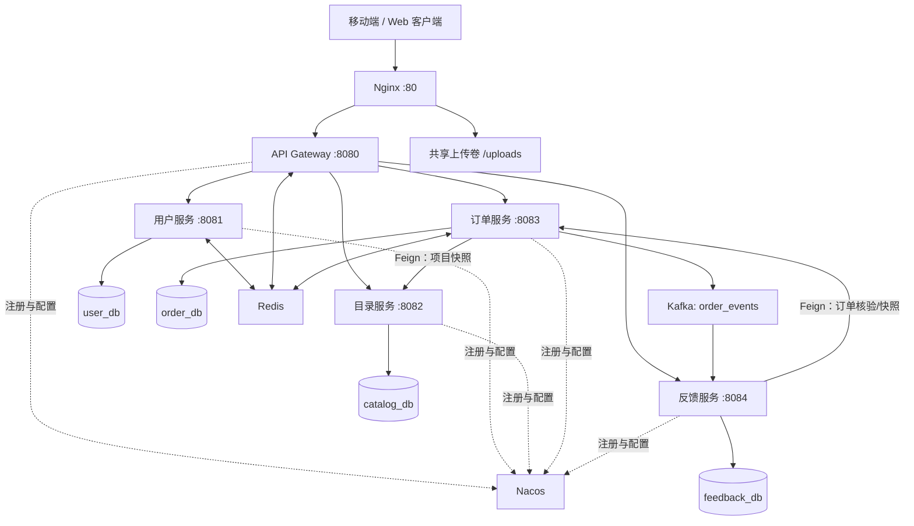
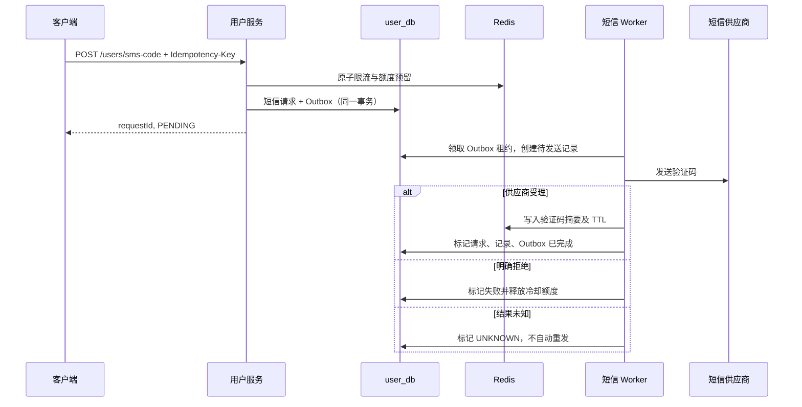
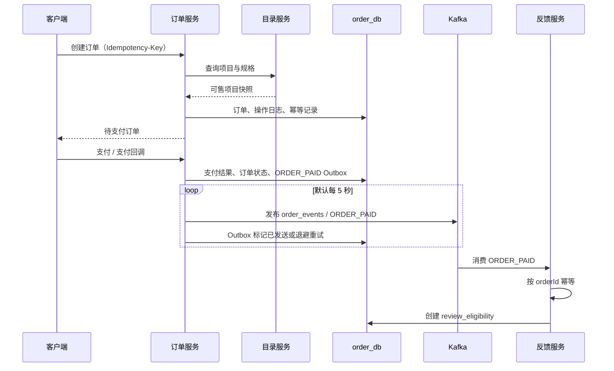
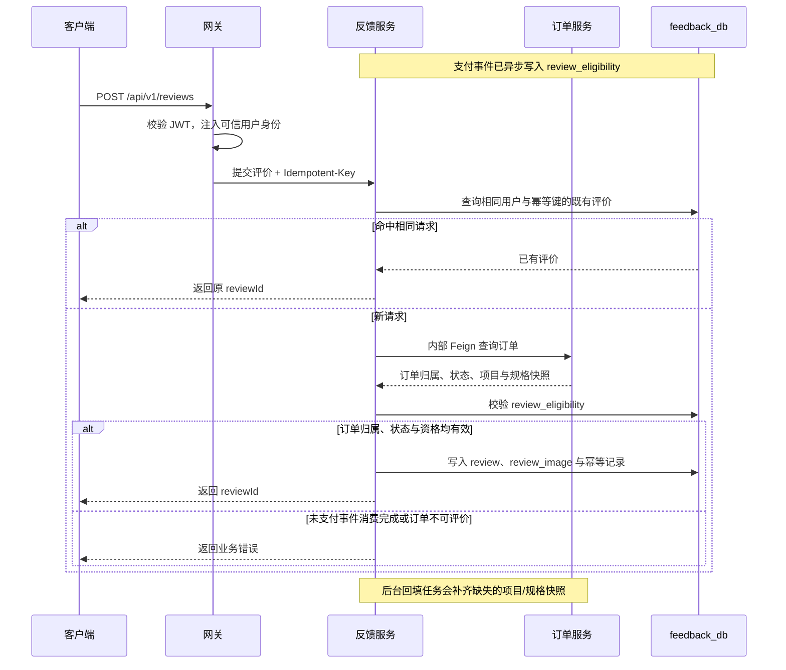
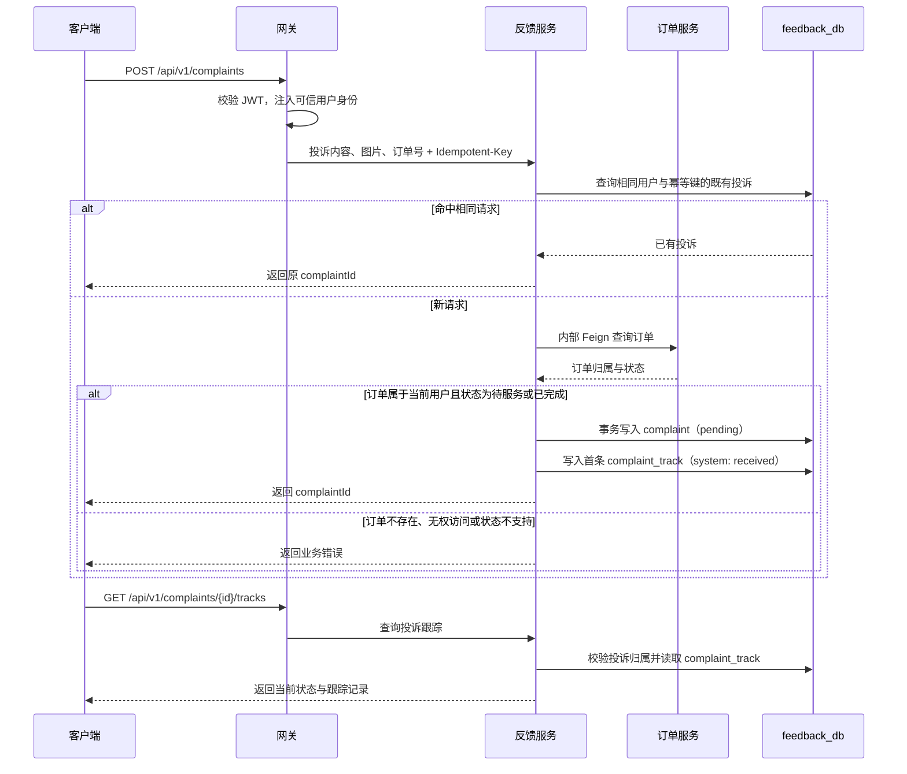

# 智慧护理平台系统设计说明文档

## 1. 文档概览

| 项目 | 内容 |
|---|---|
| 系统名称 | Internet + 智慧护理移动平台后端（Nursing Platform） |
| 版本基线 | `1.0.0-SNAPSHOT` |
| 技术栈 | Java 21、Spring Boot 3.5、Spring Cloud 2025、Spring Cloud Alibaba、MyBatis、MySQL、Redis、Kafka、Nacos、Docker Compose |
| 架构风格 | 按业务域拆分的微服务，网关统一入口，服务独立数据库，同步查询与异步领域事件结合 |
| 本文依据 | 当前仓库中 Maven 配置、源码、SQL 迁移脚本、Docker Compose 与环境变量模板 |

本文描述当前代码已实现的架构与运行方式。未在源码中实现的后台管理、角色权限、真实支付或真实短信供应商配置，不作为既有能力陈述。

## 2. 业务范围

系统面向护理服务的线上浏览、下单与服务后反馈流程，当前后端覆盖以下领域：

- 用户：短信验证码、注册登录、JWT 会话、个人资料、证件信息保护、文件上传。
- 服务目录：服务分类树、服务项目、服务规格、列表检索与详情。
- 订单：地址簿、预约下单、待支付订单、支付回调、取消、完成、退款及操作记录。
- 反馈：订单评价、评价图片、投诉、投诉跟踪和评价资格。
- 平台能力：网关鉴权、服务发现、配置管理、缓存、消息事件、数据库迁移与容器化部署。

## 3. 总体架构

### 3.1 架构原则

1. **按领域拆分，独立存储。** 每个业务服务使用独立数据库和账号，避免跨库写事务。
2. **入口统一治理。** 客户端经 Nginx 和网关访问业务 API，业务容器只在内部网络暴露端口。
3. **同步调用用于即时校验，事件用于最终一致性。** 下单时同步读取目录数据；支付后通过 Kafka 创建评价资格。
4. **关键外部副作用以 Outbox 保护。** 订单事件和短信发送任务先在本地事务写入 Outbox，再由 Worker 异步投递或执行。
5. **请求和事件均可幂等。** 下单、支付、短信、评价、投诉等业务拥有幂等键或唯一约束，消费者按业务主键去重。

## 4. 服务与职责

| 模块 | 服务名 / 端口 | 主要职责 | 依赖 |
|---|---|---|---|
| `nursing-gateway` | `nursing-gateway` / 8080 | 路由、JWT 校验、黑名单检查、受信身份头注入 | Nacos、Redis |
| `nursing-user-service` | `nursing-user-service` / 8081 | 用户、登录、Token、短信、资料与上传 | MySQL、Redis、Nacos |
| `nursing-catalog-service` | `nursing-catalog-service` / 8082 | 分类、服务项目、规格的只读查询 | MySQL、Nacos |
| `nursing-order-service` | `nursing-order-service` / 8083 | 地址、订单、支付、退款、订单 Outbox | MySQL、Redis、Kafka、Nacos、目录服务 |
| `nursing-feedback-service` | `nursing-feedback-service` / 8084 | 评价、投诉、订单支付事件消费、评价快照回填 | MySQL、Kafka、Nacos、订单服务 |
| `nursing-common` | 共享库 | 响应模型、异常、Snowflake ID、DTO、Feign 声明、订单支付事件契约 | 被业务服务依赖 |

### 4.1 网关路由

| API 前缀 | 目标服务 |
|---|---|
| `/api/v1/users/**`、`/api/v1/files/**` | 用户服务 |
| `/api/v1/categories/**`、`/api/v1/items/**` | 目录服务 |
| `/api/v1/orders/**`、`/api/v1/addresses/**` | 订单服务 |
| `/api/v1/reviews/**`、`/api/v1/complaints/**` | 反馈服务 |

网关默认开放的路径为验证码、注册、登录、密码重置、目录查询和支付回调；其余路由需要 `Authorization: Bearer <JWT>`。网关会：

1. 移除客户端传入的 `X-User-Id`、`X-UserId`、`userId`、`X-Gateway-Token`。
2. 校验 JWT 签名、`jti` 与用户标识；查询 Redis 的 `jwt:blacklist:{jti}`。
3. 验证成功后注入可信的 `X-User-Id` 与 `X-Gateway-Token` 后转发。
4. 黑名单中的 Token 除登出接口外均返回 401；Redis 查询失败按不可信处理。

业务服务通过网关可信令牌识别用户；订单与反馈的内部接口另使用 `X-Internal-Token` 限制服务间访问。

## 5. 关键业务设计

### 5.1 用户、认证与敏感信息

用户可通过密码或短信验证码登录。密码使用 Spring Security 的 `PasswordEncoder` 哈希；JWT 中包含用户 ID 和 `jti`，用户登出时将 `jti` 写入 Redis 黑名单。用户资料更新使用版本号进行乐观锁控制：版本不一致但内容一致的重试可直接返回当前结果，内容不同则返回冲突。

身份证号在写库前经 AES-GCM 加密，响应时只返回脱敏信息。文件上传按业务类型校验文件大小、扩展名与 MIME 类型，并以 `Idempotent-Key` 和 SHA-256 内容哈希避免重复落盘。上传数据由用户服务写入共享卷，Nginx 以 `/uploads/` 只读公开。

### 5.2 短信可靠投递

短信请求的状态包括 `PENDING`、`PROCESSING`、`SENT_ACCEPTED`、`FAILED`、`UNKNOWN`。Worker 默认每秒扫描任务，使用领取租约防止并发重复执行；准备阶段故障采用指数退避，超过重试上限进入死信状态。供应商调用超时或结果不明时不会自动再发，避免用户收到重复验证码。

### 5.3 下单、支付与事件投递

下单时，订单服务通过 OpenFeign 调用目录服务获取项目与规格，校验可售状态并冻结订单所需的展示/价格快照；地址、预约时段、下单幂等键和订单状态由订单服务本地处理。支付支持开发环境模拟开关及支付网关配置；支付状态变化记录在订单、支付记录、操作日志和事件 Outbox 中。

订单支付事件的键为 `order_paid:{orderId}`，Payload 为共享的 `OrderPaidEvent`：`eventType`、订单 ID/编号、用户 ID、服务项目 ID 与支付时间。Outbox 投递失败以指数退避重试，单次等待 Kafka 确认最长 5 秒。

订单超时扫描默认每 60 秒执行，将超过付款窗口（默认 30 分钟）的待支付订单取消。退款任务默认每 5 秒领取待处理记录，使用租约、指数退避和最大重试次数；达到上限会标记为人工处理。

### 5.4 评价与投诉

评价提交时，反馈服务通过内部 Feign 接口核验订单归属及状态，同时检查 `review_eligibility`。该资格由 `ORDER_PAID` 事件异步建立，因此支付完成后到消费者处理完成前可能短暂无法评价；这是当前最终一致性设计的预期行为。评价图片与订单中的项目/规格名称快照一并保存。定时任务会对缺失快照的历史评价批量回填，调用订单服务失败时保留记录，在下次执行重试。

投诉记录初始为待处理状态，支持按用户查询投诉及查看跟踪记录。评价和投诉提交均使用幂等记录避免重复创建。

#### 评价流程

#### 投诉流程

## 6. API 边界

| 领域 | 主要 API | 认证要求 |
|---|---|---|
| 用户 | `POST /api/v1/users/register`、`/login`、`/logout`、`/password/reset` | 登出需要 JWT；其余见网关公开策略 |
| 短信 | `POST /api/v1/users/sms-code`、`GET /api/v1/users/sms-code/requests/{requestId}` | 使用 `Idempotency-Key`；查询需相同幂等键 |
| 资料/文件 | `GET/PATCH /api/v1/users/profile`、`POST /api/v1/files/upload` | JWT |
| 目录 | `GET /api/v1/categories`、`GET /api/v1/items`、`GET /api/v1/items/{id}` | 公开 |
| 地址 | `GET/POST /api/v1/addresses`、`PATCH/DELETE /{id}`、`PUT /{id}/default` | JWT |
| 订单 | 创建、分页、详情、取消、完成、预支付令牌、支付、支付回调 | 回调公开；其余 JWT |
| 反馈 | `POST/GET /api/v1/reviews`、`POST/GET /api/v1/complaints`、投诉跟踪查询 | JWT |
| 内部订单 | `GET /internal/v1/orders/{id}`、`POST /internal/v1/orders/batch` | `X-Internal-Token` |

公共响应由 `nursing-common` 统一封装为 `Result` 与 `PageResult`；公共异常处理负责将参数、业务和系统异常转为标准错误码。

## 7. 数据设计

### 7.1 数据库归属

| 数据库 | 核心表 | 说明 |
|---|---|---|
| `user_db` | `user`、`user_token`、`sms_record`、`sms_send_request`、`sms_outbox_event`、`sms_record_status_transition`、`idempotent_record`、`file_upload_record` | 用户账户、认证审计、短信可靠发送和上传记录 |
| `catalog_db` | `service_category`、`service_item`、`service_spec` | 护理服务分类、项目及规格 |
| `order_db` | `user_address`、`order_header`、`payment_record`、`payment_intent`、`refund_record`、`order_operation_log`、`idempotent_record`、`event_message` | 地址、订单、支付退款、审计、幂等与事件 Outbox |
| `feedback_db` | `review`、`review_image`、`complaint`、`complaint_track`、`review_eligibility`、`idempotent_record`、`event_message` | 评价、投诉、评价资格和消费去重 |
| `nacos_config` | Nacos 标准配置、命名空间及权限表 | 服务配置中心与注册发现的持久化存储 |

订单与反馈服务启用 Flyway，基线版本为 1；订单 V2 增加支付意图和退款可靠性结构，反馈 V2 增加评价快照字段。首次容器启动时，MySQL 初始化脚本负责创建用户库、目录库和 Nacos 库；`db-bootstrap` 创建最小权限账号，`schema-preflight` 检查迁移账号权限后业务服务再启动。

### 7.2 一致性与并发控制

| 场景 | 机制 |
|---|---|
| 用户资料更新 | `version` 乐观锁与重复提交识别 |
| 短信发送 | 幂等键、Redis 原子限流、DB Outbox、Worker 租约、状态迁移审计 |
| 文件上传 | 幂等键 + 内容 SHA-256 去重 |
| 创建订单与支付 | 业务幂等记录、状态/version 条件更新、支付记录与操作日志 |
| 跨服务支付后处理 | 订单本地 Outbox + Kafka 至少一次投递 + 消费端按订单幂等 |
| 退款 | Worker 领取租约、重试退避、人工处理终态 |

## 8. 部署与运行

### 8.1 容器拓扑

Docker Compose 在 `nursing-platform/docker-compose/docker-compose.yml` 定义：

- 基础设施：MySQL 8、Redis 7、Nacos 2.5.1、ZooKeeper、Kafka。
- 初始化任务：`db-bootstrap`、`schema-preflight`、`uploads-init`。
- 业务容器：网关、用户、目录、订单、反馈服务。
- 对外入口：Nginx 默认监听 80；仅 Nginx、MySQL（默认宿主机 13306）、Redis（6379）、Nacos（8848）和 Kafka 宿主机监听器（29092）定义了端口映射。

Nginx 将 `/api/` 反向代理给网关，将 `/uploads/` 映射为共享上传卷，同时设置 `X-Content-Type-Options`、`X-Frame-Options` 与 `Referrer-Policy` 响应头。

### 8.2 配置来源

服务通过 `application.yml` 获取非敏感默认结构，通过环境变量获取连接和密钥，并从 Nacos 的 `NURSING` 分组加载 `${spring.application.name}-${profile}.yaml`。Compose 环境把 Nacos 导入前缀设为 `optional:`，因此本地容器在 Nacos 尚无应用配置时仍可用本地配置启动。

重要环境变量包括：

| 类别 | 变量示例 |
|---|---|
| 数据库 | `NURSING_*_DB_URL`、`NURSING_*_DB_USERNAME`、`NURSING_*_DB_PASSWORD` |
| 网关安全 | `NURSING_JWT_SECRET`、`NURSING_GATEWAY_TRUSTED_TOKEN` |
| 内部调用 | `NURSING_INTERNAL_TOKEN` |
| 用户敏感数据 | `NURSING_ID_CARD_ENCRYPTION_KEY` |
| 中间件 | `NURSING_REDIS_*`、`NURSING_NACOS_*`、`NURSING_KAFKA_BOOTSTRAP_SERVERS` |
| 支付/退款 | `NURSING_PAYMENT_MOCK`、`NURSING_ALIPAY_*`、`NURSING_REFUND_*` |

## 9. 可观测性与运维

- 每个服务引入 Spring Boot Actuator，Compose 健康检查访问 `/actuator/health`。
- 业务日志按服务输出；订单 Outbox 投递、退款异常、Kafka 消费去重和评价回填失败均写入日志。
- 可恢复任务均以状态表记录结果，运维排查应优先检查：订单 `event_message`、退款记录、短信 Outbox/请求/状态迁移、评价资格和幂等记录。
- ID 由共享的 Snowflake 工具生成；各服务配置不同的 worker ID，部署时需保持实例标识不冲突。

## 10. 安全与风险边界

1. 密钥、数据库密码和内部令牌均必须由部署环境注入，不能提交真实值；JWT HS256 密钥至少 32 UTF-8 字节。
2. 业务服务应只在受控内部网络暴露，避免绕过网关伪造 `X-Gateway-Token` 或 `X-User-Id`。
3. Kafka、Redis、Nacos 和 MySQL 的 Compose 默认配置主要面向本地联调；生产环境应启用认证、TLS、备份、监控和多副本策略。
4. 当前 Kafka 单节点主题副本数为 1，不能提供生产级消息高可用。
5. 评价资格依赖异步消费，客户端需能处理支付成功后的短暂最终一致性窗口。
6. 上传文件通过 Nginx 静态公开；若业务要求私有附件，应改为鉴权下载或对象存储签名 URL。
7. 订单服务存在支付网关参数，实际生产接入前需完成签名验签、回调来源校验、对账和失败补偿演练。

## 11. 代码导航

| 主题 | 位置 |
|---|---|
| Maven 模块与版本 | `nursing-platform/pom.xml` |
| 网关路由与鉴权 | `nursing-gateway/src/main/resources/application.yml`、`nursing-gateway/src/main/java/com/nursing/gateway/filter/JwtAuthGlobalFilter.java` |
| 用户和短信 | `nursing-user-service/src/main/java/com/nursing/user/service/` |
| 目录查询 | `nursing-catalog-service/src/main/java/com/nursing/catalog/` |
| 订单、支付、退款 | `nursing-order-service/src/main/java/com/nursing/order/` |
| 订单事件契约 | `nursing-common/src/main/java/com/nursing/common/event/OrderPaidEvent.java` |
| 评价、投诉、事件消费 | `nursing-feedback-service/src/main/java/com/nursing/feedback/` |
| 基础设施与启动顺序 | `docker-compose/docker-compose.yml`、`docker-compose/db-bootstrap/`、`docker-compose/nginx/default.conf` |
| 数据库定义 | 各服务 `deploy/mysql/init/` 与订单/反馈 `src/main/resources/db/migration/` |

## 12. 建议的演进方向

1. 将订单事件、短信、退款的积压量和失败率纳入指标与告警。
2. 通过消费者重试、死信主题和可操作的补偿后台，完善 Kafka 失败处置闭环。
3. 将单节点中间件替换为具备认证、TLS、备份和多副本保障的生产部署。
4. 在网关外增加 HTTPS、访问日志追踪 ID、限流策略和 WAF/反向代理防护。
5. 若需要运营后台，新增独立管理身份体系及 RBAC，避免将其混入当前面向用户的 JWT 模型。
